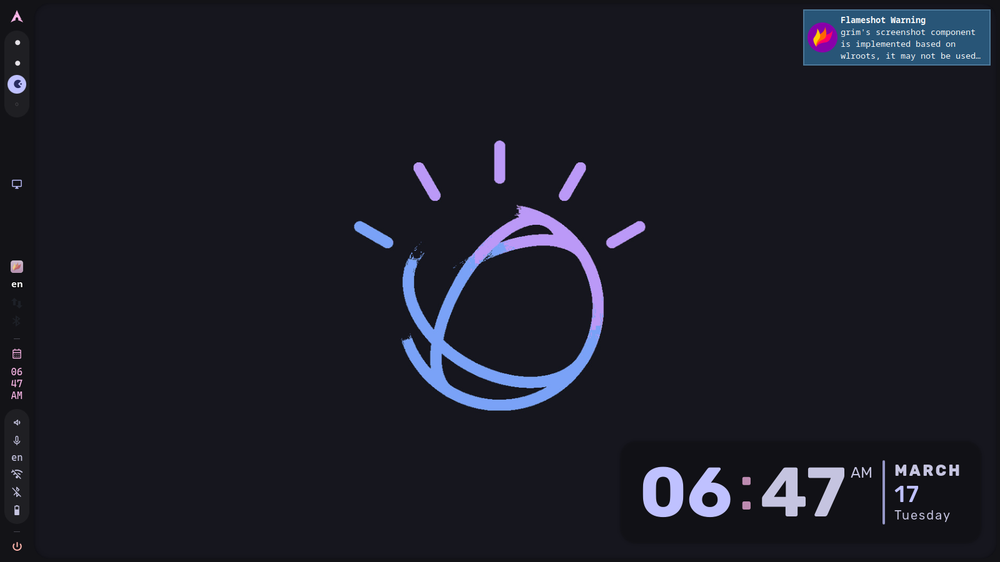
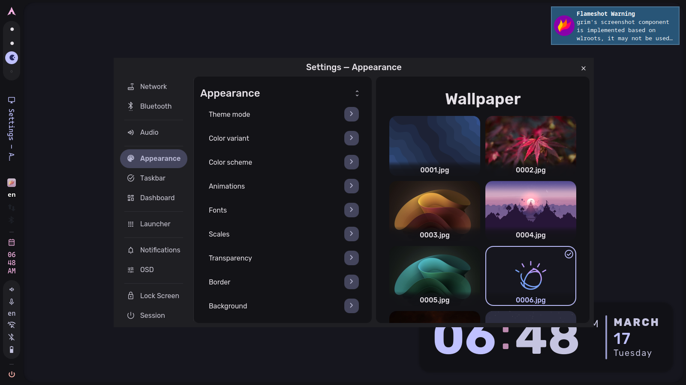
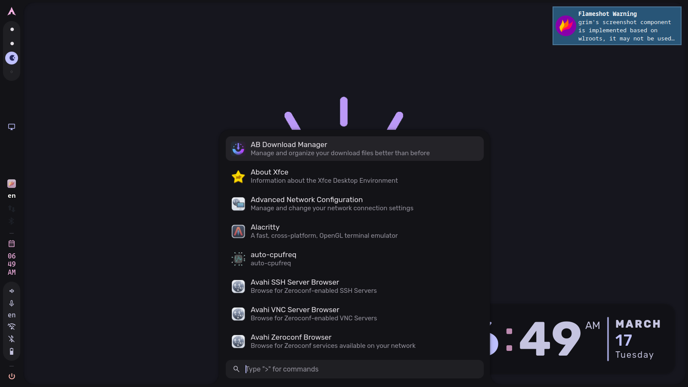
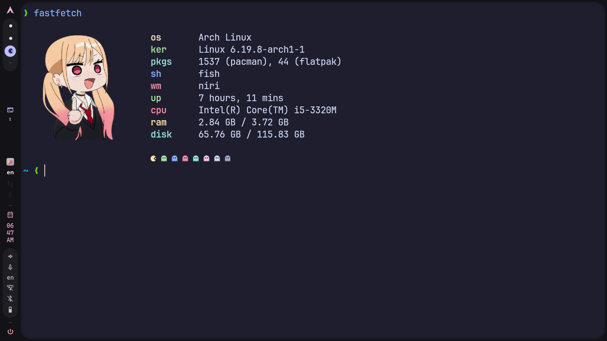
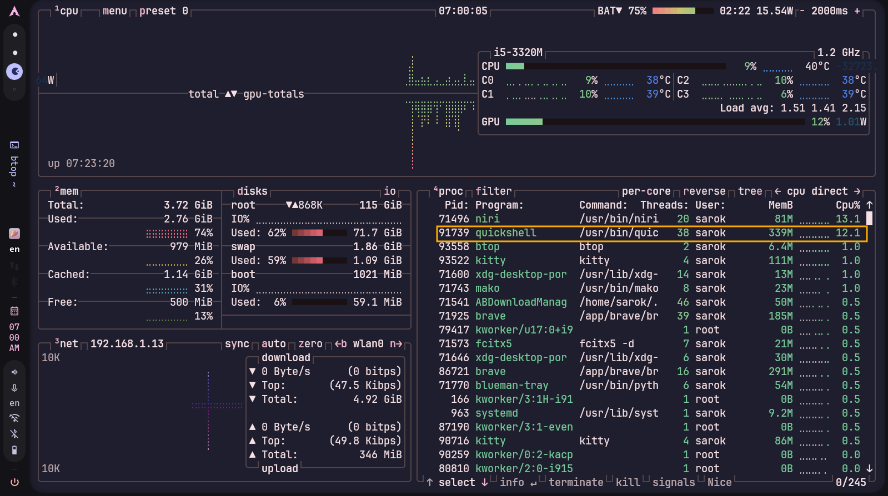

# 🌌 Niri Caelestia Dotfiles


## 📸 Screenshots

<div align="center">

### 🖥️ Desktop & Interface
| Desktop | Dashboard | Launcher |
|---------|-----------|----------|
|  |  |  |

### 🛠️ Applications
| Terminal | System Monitor |
|----------|----------------|
|  |  |

</div>

### 🎥 Video Demo
<div align="center">
  <video src="assets/videos/demo.mp4" width="800" controls>
    Your browser does not support the video tag.
  </video>
  <p><em>Quick tour of Niri + Caelestia shell</em></p>
</div>

[⬇️ Download video](assets/videos/Video_2026-03-17_06-13-46.mp4)

<div align="center">
  
  <h3>My personal Niri window manager configuration</h3>
  <p>Beautiful, functional, and fully customized with Caelestia shell</p>
</div>
## ⚠️ Important Requirements

### 1. **You must have Niri window manager installed**
This dotfiles collection is specifically made for **Niri** window manager. It will not work on other WMs like Hyprland, Sway, or i3.

```bash
# Install Niri
yay -S niri
```

### 2. **You MUST install niri-caelestia-shell first**
My configurations depend on this specific fork of Caelestia shell. Install it before running my installer:

```bash
# Clone and install niri-caelestia-shell
cd ~/.config/quickshell
git clone https://github.com/AyushKr2003/niri-caelestia-shell
cd niri-caelestia-shell

# Install dependencies (Arch Linux)
sudo pacman -S quickshell-git networkmanager fish glibc qt6-declarative gcc-libs cava libcava aubio libpipewire ddcutil brightnessctl grim swappy app2unit libqalculate wl-clipboard cliphist tesseract tesseract-data-eng curl cmake ninja
yay -S ttf-material-icons-git ttf-jetbrains-mono python-materialyoucolor

# Build and install
cmake -B build -G Ninja -DCMAKE_BUILD_TYPE=Release -DCMAKE_INSTALL_PREFIX=/
cmake --build build
sudo cmake --install build

# Run the setup script
./scripts/setup/setup.sh
```

> **🔴 IMPORTANT**: If you skip this step, my dotfiles will not work properly! The Caelestia shell must be installed **before** running my installer.

### 3. **My configurations expect:**
- The shell to be installed at: `~/.config/quickshell/niri-caelestia-shell/`
- Niri config will automatically launch it with: `spawn-at-startup "qs" "-c" "niri-caelestia-shell"`
- my keybindings are designed to work with this specific version
## ✨ Features

| Category | Tools |
|----------|-------|
| 🪟 **Window Manager** | Niri with Caelestia shell |
| 🖥️ **Terminal** | Kitty + Fish + Starship |
| 📁 **File Manager** | Yazi |
| 🎵 **Music** | MPD |
| 🎬 **Media** | MPV |
| 📊 **System Monitor** | Btop + Fastfetch |
| 📝 **Notes** | Obsidian |
| 🎛️ **Visualizer** | Cava |
| 🖱️ **Cursor** | Bibata Modern Ice |


## 🚀 Quick Installation

### Prerequisites
- **Arch Linux** 
- niri-caelestia-shell (https://github.com/AyushKr2003/niri-caelestia-shell)

### One-liner Installation

```bash
git clone https://github.com/sarok-exe/niri-caelestia-shell-dotfiles
cd niri-caelestia-shell-dotfiles
chmod +x install.sh
./install.sh
```

### What the installer does:

1. 📦 **Updates system** - `sudo pacman -Syu`
2. 🔧 **Installs yay** - AUR helper
3. 📥 **Installs all packages**:
   - From official repos (pacman)
   - From AUR (yay)
   - From Flathub (flatpak)
4. 💾 **Backs up** your current configs
5. 📋 **Copies** my configurations
6. ⚙️ **Sets up** environment variables
7. 🚀 **Configures** startup applications
8. 🐟 **Changes** default shell to Fish

## ⌨️ Keybindings

### Essential Shortcuts

| Key | Action |
|-----|--------|
| `Mod+Return` | Open Kitty terminal |
| `Mod+D` | Toggle quick toggles |
| `Mod+X` | Open control center |
| `Mod+V` | Toggle clipboard |
| `Mod+T` | Open Telegram |
| `Mod+E` | Open Yazi file manager |
| `Mod+O` | Open Obsidian |
| `Mod+S` | Toggle overview |
| `Mod+Q` | Close window |

### Window Management

| Key | Action |
|-----|--------|
| `Mod+F` | Maximize column |
| `Mod+Shift+F` | Fullscreen |
| `Mod+H/J/K/L` | Focus left/down/up/right |
| `Mod+Shift+H/J/K/L` | Move window |
| `Mod+C` | Toggle floating window |
| `Mod+R` | Switch column width |
| `Mod+Shift+R` | Switch window height |

### Workspaces

| Key | Action |
|-----|--------|
| `Mod+1-9` | Switch to workspace N |
| `Mod+Shift+1-9` | Move window to workspace N |
| `Mod+Page_Down/Up` | Next/Previous workspace |
| `Mod+U/I` | Next/Previous workspace |

### Multi-monitor

| Key | Action |
|-----|--------|
| `Mod+Ctrl+H/J/K/L` | Focus monitor |
| `Mod+Shift+Ctrl+H/J/K/L` | Move window to monitor |

### Screenshots

| Key | Action |
|-----|--------|
| `Print` | Flameshot GUI |
| `Ctrl+Print` | Full screen screenshot |
| `Alt+Print` | Current window screenshot |

### Media Controls

| Key | Action |
|-----|--------|
| `XF86AudioRaiseVolume` | Volume up |
| `XF86AudioLowerVolume` | Volume down |
| `XF86AudioMute` | Mute toggle |
| `Mod+Alt+Space` | Play/Pause |
| `Mod+Alt+Left/Right` | Previous/Next track |

### Mouse Gestures

| Gesture | Action |
|---------|--------|
| `Mod + Wheel` | Switch workspaces |
| `Mod + Ctrl + Wheel` | Move window to workspace |
| `Mod + Shift + Wheel` | Focus columns |
| `Mod + Ctrl + Shift + Wheel` | Move columns |

> **Note:** `Mod` key is the **Super/Windows** key

## 🎨 Customization Highlights

### Beautiful Animations

```kdl
animations {
    workspace-switch {
        spring damping-ratio=0.900 stiffness=800
    }
    window-open {
        duration-ms 400
        curve "ease-out-expo"
    }
}
```

### Rounded Corners

```kdl
window-rule {
  geometry-corner-radius 20
  clip-to-geometry true
}
```

### Shadow Effects

```kdl
shadow {
    softness 30
    spread 5
    offset x=0 y=5
    color "#0007"
}
```

## 🖱️ Mouse Cursor

The config uses **Bibata-Modern-Ice** cursor theme with size 30. This is installed automatically by the script.

## 🔧 Manual Installation (if needed)

If you prefer to install manually:

```bash
# Install packages
<<<<<<< HEAD
sudo pacman -S fish starship kitty mpd mpv btop fastfetch cava flameshot fcitx5
=======
sudo pacman -S fish starship kitty  mpv btop fastfetch cava  flameshot fcitx5
>>>>>>> e641b0d (Add clean screenshots and update gallery)
yay -S yazi niri obsidian rmpc blanket keypunch niri-caelestia-shell-git bibata-modern-ice-cursor-theme
flatpak install flathub io.github.alainm23.planify com.github.PintaProject.Pinta com.brave.Browser org.telegram.desktop

# Copy configs
<<<<<<< HEAD
cp -r kitty niri fish starship.toml yazi mpd mpv btop fastfetch obsidian cava niri_caelestia ~/.config/
=======
cp -r kitty niri fish starship.toml yazi  mpv btop fastfetch obsidian cava  niri_caelestia ~/.config/
>>>>>>> e641b0d (Add clean screenshots and update gallery)

# Change shell
chsh -s $(which fish)
```

## 📁 Repository Structure

```
niri-dotfiles/
├── install.sh          # Installation script
├── README.md           # This file
├── kitty/              # Kitty terminal config
├── niri/               # Niri window manager config
├── starship.toml       # Starship prompt config
├── yazi/               # Yazi file manager config
├── mpd/                # Music Player Daemon config
├── mpv/                # MPV media player config
├── btop/               # Btop system monitor config
├── fastfetch/          # Fastfetch system info config
├── cava/               # Cava audio visualizer config
└── niri_caelestia/     # Caelestia shell config
```
### Getting Help

- [Niri GitHub](https://github.com/YaLTeR/niri)
- [Caelestia GitHub](https://github.com/caelestia-dots/shell)
- [niri Caelestia GitHub](https://github.com/AyushKr2003/niri-caelestia-shell)
- Open an issue in this repository

## 📝 To-Do

- [*] Add more keybindings
- [ ] Add wallpapers
- [ ] Create installation video

## 🤝 Credits

- [YaLTeR](https://github.com/YaLTeR) - Creator of Niri
- [caelestia-dots](https://github.com/caelestia-dots) - Creator of Caelestia shell
- [AyushKr2003](https://github.com/AyushKr2003) - Creator of niri Caelestia shell
- All the open source projects that made this possible

## 📜 License

This dotfiles collection is open source and free to use. Feel free to modify and share!

---

<div align="center">
  <p>Made with ❤️ for the Niri community</p>
  <p>⭐ Star this repo if you find it useful! ⭐</p>
</div>
